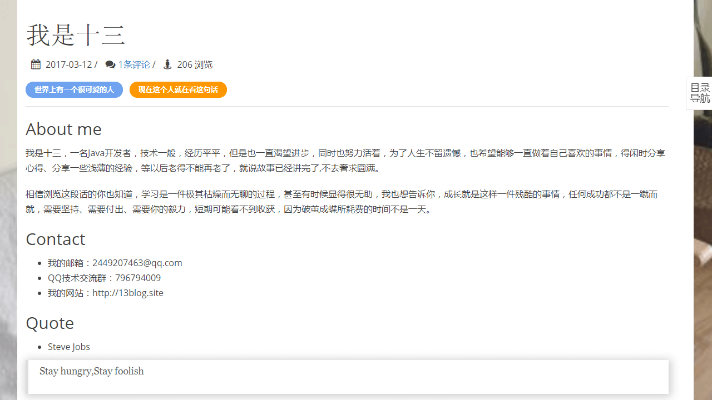
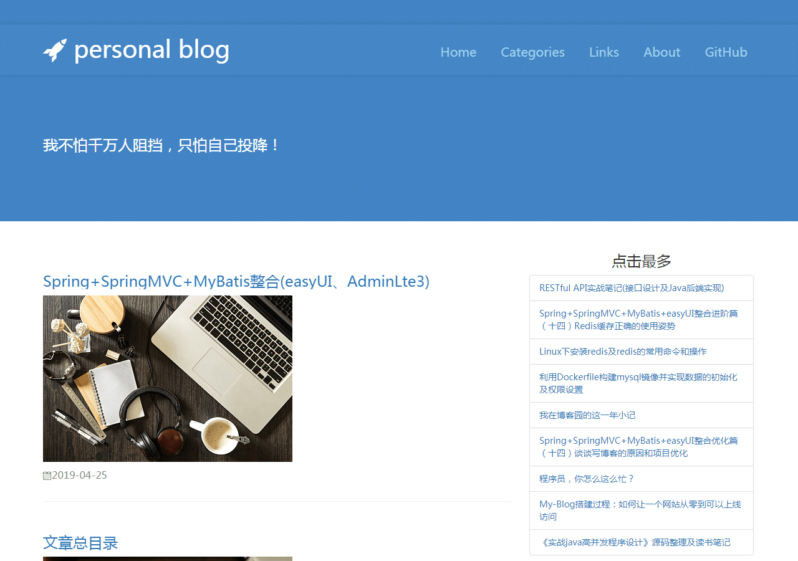
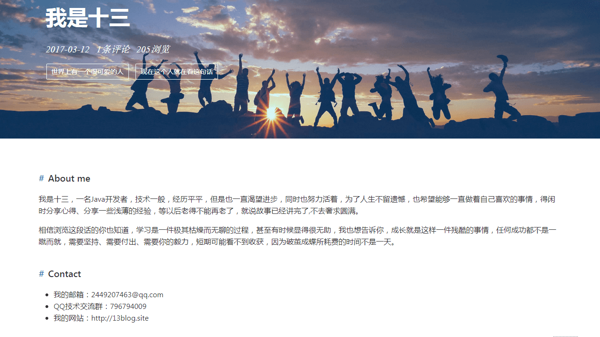

# My Blog

**多列介绍，谢谢各位的支持。**

- **你也可以把它作为 SpringBoot 技术栈的学习项目，My Blog也足够符合要求，且代码和功能完备；**
- **技术栈新颖且知识点丰富，学习后可以提升大家对于知识的理解和掌握，对于提升你的市场竞争力有一定的帮助。**

> 更多 Spring Boot 实战项目另一个代码仓库 [spring-boot-projects](https://github.com/ZHENFENG13/spring-boot-projects)，该仓库中主要是 Spring Boot 的入门学习教程以及一些常用的 Spring Boot 实战项目教程

## 开发文档

### 《SpringBoot + Mybatis + Thymeleaf》

## 联系作者

> 大家有任何问题或者建议都可以在 [issues](https://github.com/ZHENFENG13/My-Blog/issues) 中反馈给我，我会慢慢完善这个项目。

- 我的邮箱：1037507338@qq.com

#### 模板一

- 首页

	

- 文章浏览

	

- 友情链接

	

#### 模板二

- 首页

	

- 文章浏览

	

- 友情链接

	

#### 模板三

- 首页

  

- 文章浏览

  

- 友情链接

  
